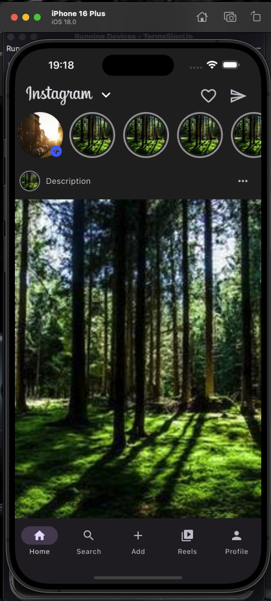

An unnecessarily overengineered😬, attempt at using my own architecture, cloning instagram using DDD,CA,Firebase, Bloc and TDD(test-after😶‍🌫️), work in progress.

## Platforms

- [x] Android
- [x] iOS
- [ ] Web
- [ ] Desktop
- [ ] Linux
- [ ] Mac
- [ ] Windows

## Pages

- [x] Home
      
- [x] Add media
      
